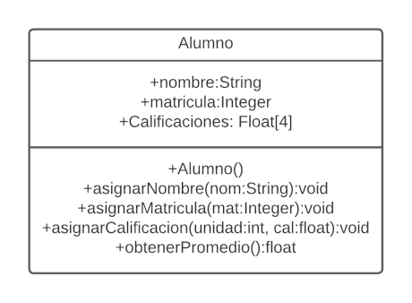

# Actividad 2 - Estructuras Secuenciales
## Promedio de un alumno


Un estudiante realiza cuatro exámenes durante el semestre, los cuales tienen la misma ponderación. Implemente el programa correspondiente para obtener el promedio de las calificaciones obtenidas.

Se deberá generar una clase denominada `Alumno` siguiendo la estructura del Diagrama siguiente:



Dicha clase deberá ser invocada desde la clase `Main`, que será la clase principal del programa. 

Cada dato deberá se solicitado e ingresado por medio del flujo de datos estandar.

## Resultados esperados

Se presenta a continuación un par de ejemplos de entradas y salidas del programa.

### Ejemplo 1

```bash
$java Main
**** Calculo del promedio de un alumno ***
Ingrese el nombre: Juan Lopez Hernandez
Ingrese la matricula: 12345678
Ingrese la calificacion de la unidad 1: 85.2
Ingrese la calificacion de la unidad 2: 90.5
Ingrese la calificacion de la unidad 3: 70.2
Ingrese la calificacion de la unidad 4: 99.3
El promedio del alumno Juan Lopez Hernandez es 86.3
```

## Ejemplo 2

```bash
$java Main
**** Calculo del promedio de un alumno ***
Ingrese el nombre: Lizbeth Benitez Baez
Ingrese la matricula: 87654321
Ingrese la calificacion de la 1ra unidad: 70.3
Ingrese la calificacion de la 2da unidad: 62.5
Ingrese la calificacion de la 3ra unidad: 50.2
Ingrese la calificacion de la 4ta unidad: 80.3
El promedio del alumno Lizbeth Benitez Baez es 65.825
```